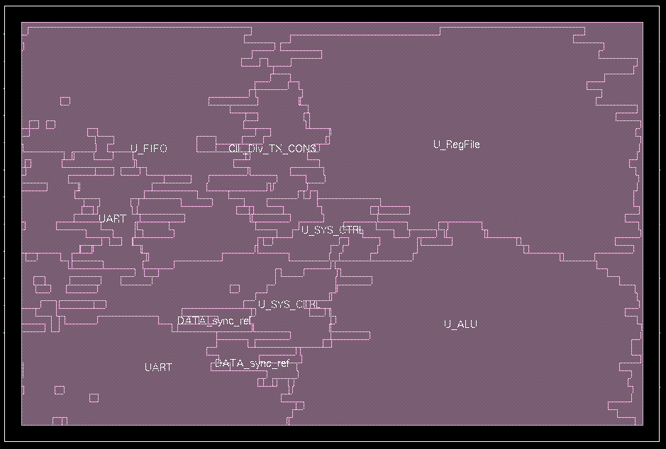
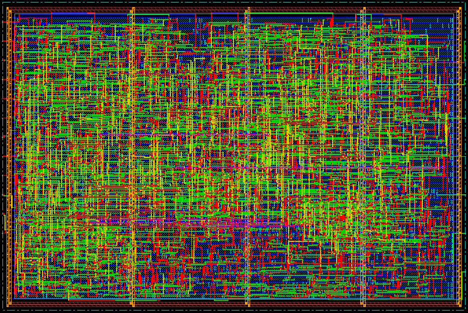

<div align="center">

  <h1 align="center">Low-Power Configurable Multi-Clock Digital System</h1>
  <p align="center">
    <strong>Full RTL-to-GDS implementation of a UART-driven register/ALU compute system, spanning RTL design, self-checking verification, synthesis, DFT insertion, formal equivalence checking, and physical implementation.</strong>
  </p>

  [](#-system-architecture)
  [](#-implementation--results)
  [](#-implementation--results)
  [](#-implementation--results)
  [](#-formal-verification)
</div>

<br />

## 📖 Table of Contents
- [Project Overview](#-project-overview)
- [Problem Definition](#-problem-definition)
- [System Architecture](#-system-architecture)
- [Register Map & Command Protocol](#-register-map--command-protocol)
- [Verification Methodology](#-verification-methodology)
- [Repository Structure](#-repository-structure)
- [Implementation & Results](#-implementation--results)
- [Formal Verification](#-formal-verification)
- [Physical Layout](#-physical-layout)
- [Optimization Strategies](#-optimization-strategies)

<br />

## 🚀 Project Overview

Many embedded control systems need to accept commands over a simple serial link, act on them locally (register access, arithmetic/logic operations), and report results back — all while different parts of the chip legitimately need to run at different clock rates for power and interface reasons. Naively running everything from one fast clock wastes power; naively crossing clock domains without synchronization risks metastability and data corruption.

This repository contains the complete **RTL design, functional verification, synthesis, DFT insertion, formal equivalence checking, and physical implementation (RTL-to-GDS)** of a **Low-Power Configurable Multi-Clock Digital System**. The system receives commands over a UART receiver to read/write an internal register file or trigger ALU operations, then returns results through a UART transmitter. An **asynchronous FIFO** decouples the compute domain from the UART transmit domain so that no data is lost across the clock-rate boundary, and **clock gating** on the ALU's clock keeps switching activity — and therefore dynamic power — down when the ALU is idle.

The design was taken through a **complete ASIC flow on a TSMC 130nm standard-cell library**: RTL design and self-checking simulation, constrained synthesis with Design Compiler, scan-based DFT insertion, gate-level formal equivalence checking against the RTL at both the post-synthesis and post-DFT stages, and physical implementation through floorplanning, placement, clock tree synthesis, and routing.

### Key Specifications
- **Serial Command Interface:** 8-bit UART receiver/transmitter with configurable baud-rate prescaler and selectable parity (even/odd/disabled), plus live parity- and framing-error detection.
- **On-Chip Compute:** 16×8-bit register file feeding a 15-function ALU (arithmetic, logic, comparison, shift) with a 16-bit result bus.
- **Multi-Clock Domain Partitioning:** Four independently derived clocks — a reference clock for the core datapath, a gated clock for the ALU, and two UART-side clocks generated by configurable integer clock dividers.
- **Safe Clock-Domain Crossing:** Dedicated reset synchronizers, a multi-stage data/bit synchronizer, and a dual-clock asynchronous FIFO (Gray-code pointers) protect every signal that crosses a clock boundary.
- **Low-Power Techniques:** Integrated clock gating on the ALU clock and divided clocks on the UART side minimize unnecessary toggling.
- **Fully Parameterized:** `DATA_WIDTH`, register-file `ADDR` width/depth, synchronizer stage counts, and FIFO depth/address width are all set via Verilog parameters.
- **Silicon-Ready:** Zero setup/hold timing violations at synthesis, 99.50% stuck-at test coverage after scan insertion, and 100% gate-level formal equivalence to the RTL at every stage.

<br />

## 🧩 Problem Definition

A host needs a lightweight way to remotely read and write internal state and trigger simple compute operations on a chip, over a standard asynchronous serial link, without forcing the whole chip to run at the UART's (comparatively very slow) bit rate. The system must:
- Decode incoming UART frames into write/read/ALU commands and drive a register file and ALU accordingly.
- Move results computed on a fast reference clock safely across to the much slower, independently-derived UART transmit clock without losing data or introducing metastability.
- Detect and report line-level errors (parity, framing) rather than silently accepting corrupted frames.
- Gate unused clocks to reduce dynamic power when the ALU is idle.
- Remain fully parameterized so data width, addressing, and buffering can be rescaled for other applications.
- Be provably correct not just at RTL, but through synthesis and DFT insertion, and be physically implementable in silicon.

<br />

## 🏗 System Architecture

The design is composed of the following sub-blocks, structurally wired together by the top-level module (`SYS_TOP`).

### SYS_CTRL
The central FSM. Decodes the 8-bit opcode received from the UART (`0xAA` register write, `0xBB` register read, `0xCC` ALU operation, `0xDD` ALU pass-through) and sequences the register file and ALU accordingly, then packages results for transmission back over UART.

### RegFile
A 16-entry × 8-bit register file. Two locations are hardwired to feed the ALU operands (`OP_A`, `OP_B`); a third holds the live UART configuration (baud-rate prescale, parity enable, parity type) and a fourth holds the transmit-side clock-divide ratio — making the link's own baud rate and framing behavior runtime-configurable through the same command interface it serves.

### ALU
A 15-function arithmetic/logic/comparison/shift unit (add, subtract, multiply, divide, AND/OR/NAND/NOR/XOR/XNOR, equal/greater-than/less-than, and logical shifts) with a registered 16-bit output and a valid flag, clocked by a gated clock so it draws no dynamic power when disabled.

### CLK_GATE
An integrated clock-gating cell that gates the ALU's clock from the reference clock based on an enable signal from `SYS_CTRL`, cutting switching activity on the ALU's clock tree whenever no operation is pending.

### ClkDiv / CLKDIV_MUX
A parameterized integer clock divider generates the UART transmit clock from the UART reference clock at a configurable ratio (register-controlled); a second instance, fed through a small select mux, derives the UART receive clock at the ratio configured in the UART_CONFIG register — allowing RX and TX to run at independently tunable baud rates.

### UART_TOP (UART_RX / UART_TX)
A full asynchronous serial transceiver, built from dedicated sub-blocks: start/stop-bit detection, mid-bit data sampling, a serial-to-parallel deserializer and parallel-to-serial serializer, parity calculation/checking, and dedicated RX/TX finite-state machines — with live parity-error and framing-error outputs.

### ASYNC_FIFO
A dual-clock, dual-port asynchronous FIFO used to safely move transmit data from the fast reference-clock domain into the much slower, independently-derived UART transmit-clock domain. Uses Gray-coded read/write pointers and dedicated bit synchronizers (`bit_sync`) on each pointer to guarantee metastability-safe full/empty flag generation across the clock-domain boundary.

### RST_SYNC / DATA_SYNC
Multi-stage (parameterized depth) reset and data synchronizers used throughout the design to safely bring the asynchronous reset and cross-domain data/valid signals into each local clock domain.

### PULSE_GEN
Converts the UART transmitter's level-sensitive busy signal into a single-cycle pulse, used to generate a clean read-enable strobe for the asynchronous FIFO.

### SYS_TOP
The structural top level. Instantiates and wires together all sub-blocks, deriving the ALU, UART RX, and UART TX clock domains from a shared reference and UART clock, and exposing only the external UART and status pins (`UART_RX_IN`, `UART_TX_O`, `parity_error`, `framing_error`).

<br />

## 📋 Register Map & Command Protocol

| Address | Register | Description |
|---|---|---|
| `0x0` | `OP_A` | ALU operand A |
| `0x1` | `OP_B` | ALU operand B |
| `0x2` | `UART_CONFIG` | `[7:2]` baud prescale · `[1]` parity type · `[0]` parity enable |
| `0x3` | `DIV_RATIO` | UART TX clock-divide ratio |
| `0x4`–`0xF` | General purpose | Free read/write storage |

| Opcode | Command | Behavior |
|---|---|---|
| `0xAA` | Register Write | Writes the following byte to the addressed register |
| `0xBB` | Register Read | Reads back and transmits the addressed register |
| `0xCC` | ALU Operation | Executes the selected ALU function on `OP_A`/`OP_B` and returns the result |
| `0xDD` | ALU Pass-Through | Bypasses the ALU function decode (no-op path) |

<br />

## 🛡 Verification Methodology

The design was verified with a **self-checking Verilog testbench** driving `SYS_TOP` through its external UART pins — exercising the design exactly as a real host would.

- **Directed serial stimulus:** Tasks assemble and serialize full UART frames (start bit, 8 data bits, optional parity, stop bit) at the configured baud rate to drive `UART_RX_IN`.
- **Self-checking tasks:** Dedicated tasks (`APPLY_WRITE_CMD_CHECK`, `APPLY_READ_CMD_CHECK`, `APPLY_ALU_CMDS_CHECK`, …) compare observed register/ALU results and transmitted UART responses against expected values automatically.
- **Multiple runtime configurations:** Tests re-configure the UART baud prescale and parity mode (even, odd, disabled) mid-simulation and confirm the system continues to operate correctly with the new configuration.
- **Negative testing:** Dedicated tasks intentionally inject a wrong parity bit and a wrong stop bit to confirm `parity_error` and `framing_error` assert correctly, proving the error-detection paths — not just the happy path — are exercised.
- **Coverage:** Register writes/reads across multiple addresses, all major ALU operations, back-to-back commands, and both link-level error conditions.

<br />

## 📂 Repository Structure

```text
📁 low-power-multi-clock-digital-system/
├── 📁 RTL/
│   ├── 📁 SYS_TOP/          # Structural top-level integration
│   ├── 📁 SYS_CONTROL/      # Main command-decode FSM
│   ├── 📁 RegFile/          # 16x8 register file
│   ├── 📁 ALU/              # 15-function ALU
│   ├── 📁 CLK_GATING/       # Integrated clock gate for the ALU clock
│   ├── 📁 CLOCK_DIV/        # Configurable integer clock divider
│   ├── 📁 CLKDIV_MUX/       # RX clock-divide ratio select mux
│   ├── 📁 UART/
│   │   ├── 📁 UART_TOP/     # Transceiver integration
│   │   ├── 📁 UART_RX/      # Receiver sub-blocks + FSM
│   │   └── 📁 UART_TX/      # Transmitter sub-blocks + FSM
│   ├── 📁 ASYNC_FIFO/       # Dual-clock async FIFO (Gray-code pointers)
│   ├── 📁 RST_SYNC/         # Multi-stage reset synchronizer
│   ├── 📁 DATA_SYNC/        # Multi-stage data/valid synchronizer
│   ├── 📁 PULSE_GEN/        # Level-to-pulse converter
│   └── 📁 SYS_TOP_TB/       # Self-checking system testbench
├── 📁 SYNTHESIS/            # Design Compiler scripts, constraints, netlist, reports
├── 📁 DFT_SYNTHESIS/        # Scan insertion, DFT netlist, ATPG/coverage reports
├── 📁 FORMAL_VERIFICATION/  # Formality post-synthesis & post-DFT equivalence checks
├── 📁 PNR/                  # Floorplan/placement and post-route layout views
├── 📁 SIMULATION_TRANSCRIPT/# Simulation console output captures
└── 📄 README.md
```

<br />

## 📊 Implementation & Results

### Multi-Clock Domain Summary (post-synthesis)

| Clock | Period | Frequency | Source |
|---|---|---|---|
| `REF_CLK` | 20.00 ns | 50 MHz | Primary input |
| `ALU_CLK` | 20.00 ns | 50 MHz | Gated from `REF_CLK` |
| `UART_CLK` | 271.27 ns | ~3.686 MHz | Primary input |
| `UART_RX_CLK` | 271.27 ns | ~3.686 MHz | Divided from `UART_CLK` (configurable ratio) |
| `UART_TX_CLK` | 8680.54 ns | ~115.2 kHz | Divided from `UART_CLK` (÷32) |

### Synthesis (Design Compiler, TSMC 130nm)
- **Library:** TSMC 130nm standard-cell library (`scmetro_tsmc_cl013g`, SS corner, 1.08V, 125°C).
- **Timing Closure:** **Zero violated constraints** — all setup and hold checks met across all five clock domains.
- **Cell Count:** 1,833 cells (1,425 combinational, 370 sequential) across 16 unique references.
- **Total Cell Area:** 22,419.7 µm².
- **Total Power:** 0.221 mW (largest contributors: register file ~47%, async FIFO ~28%, ALU ~7.5%).

### DFT Insertion (Scan)
- **Scan chains** architected and routed over the synthesized netlist; 349 of 350 sequential cells converted to valid scan cells.
- **Post-DFT constraints:** Zero violated timing constraints.
- **ATPG stuck-at test coverage:** **99.50%** (15,082 of 15,354 faults detected; remaining faults are predominantly untestable/undetectable rather than unaddressed).
- **Post-DFT cell area:** 25,104.9 µm² (includes scan mux/DFT overhead).

<br />

## 🔬 Formal Verification

Gate-level netlists were formally proven equivalent to the golden RTL using **Synopsys Formality**, at two separate stages of the flow:

| Stage | Compare Points | Passing | Failing | Result |
|---|---|---|---|---|
| Post-Synthesis | 353 | 353 | 0 | ✅ 100% Equivalent |
| Post-DFT | 353 | 353 | 0 | ✅ 100% Equivalent |

No failing, aborted, or unverified points were reported at either stage — confirming that neither logic synthesis nor scan-chain insertion altered the design's intended functional behavior.

<br />

## 🖼 Physical Layout

<div align="center">
  <table>
    <tr>
      <td align="center"><strong>Floorplan & Placement</strong></td>
      <td align="center"><strong>Post-Route Layout</strong></td>
    </tr>
    <tr>
      <td></td>
      <td></td>
    </tr>
  </table>
</div>

Major functional blocks (`U_FIFO`, `UART`, `U_RegFile`, `U_ALU`, `U_SYS_CTRL`, clock dividers) are clearly separable in the floorplan, and the design closes routing cleanly across all four power/signal tracks visible in the post-route view.

<br />

## ⚙ Optimization Strategies

1. **Integrated Clock Gating on the ALU** — `CLK_GATE` disables the ALU's clock tree whenever no ALU operation is pending, directly cutting dynamic switching power on the design's largest arithmetic block.
2. **Configurable Clock Division Instead of a Single Fast Clock** — the UART RX/TX paths run from independently divided, much slower clocks rather than the fast reference clock, avoiding unnecessary toggling on I/O-facing logic that doesn't need to run fast.
3. **Gray-Coded Asynchronous FIFO Pointers** — `ASYNC_FIFO` uses Gray-code read/write pointers with dedicated bit synchronizers so full/empty flag generation across the reference-clock ↔ UART-TX-clock boundary is metastability-safe without stalling the producer.
4. **Decoupled Reset & Data Synchronization** — dedicated, parameterized `RST_SYNC` and `DATA_SYNC` blocks isolate clock-domain-crossing concerns from the functional blocks, keeping `SYS_CTRL`, `RegFile`, and `ALU` free of ad-hoc synchronization logic.
5. **Runtime-Configurable Link Parameters** — baud-rate prescale, parity mode, and the TX clock-divide ratio all live in the register file itself, so the link's own timing/framing behavior can be reconfigured through the same command protocol it serves, without a re-synthesis.
6. **Full Parameterization** — `DATA_WIDTH`, register-file address width/depth, synchronizer stage counts, and FIFO depth/address width are all set via Verilog parameters, letting the entire system rescale from the top level alone.

---
*Low-Power Configurable Multi-Clock Digital System — RTL-to-GDS Design & Verification Documentation*
